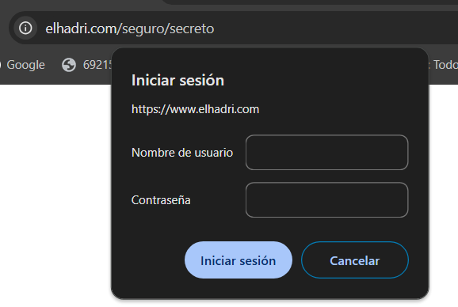

# Proxy Inverso con NGINX

## Tabla de Contenidos

- [Explicación](#explicación)
- [Dominios](#dominios)
- [Configuración por defecto](#configuración-por-defecto)
- [elhadri.com](#elhadricom)
- [elhadri.com/yahya](#elhadricomyahya)
- [elhadri.com/seguro](#elhadricomseguro)
- [Proxy](#proxy)
- [Hosts](#hosts)
- [Docker-compose](#docker-compose)
- [Ejecución](#ejecución)

## Explicación

Esta configuración despliega un proxy inverso con NGINX en un contenedor Docker. El proxy redirige las solicitudes a diferentes contenedores según el subdirectorio de la URL. El dominio `elhadri.com` permite acceder a:
- `elhadri.com/yahya`: Contenedor con el contenido de `yahya.com`.
- `elhadri.com/seguro`: Contenedor con el contenido de `seguro.net`, que también incluye autenticación y conexión SSL.

## Dominios

- elhadri.com
- elhadri.com/yahya
- elhadri.com/seguro

## Configuración por defecto

Se configura NGINX para escuchar en los puertos 80 y 443. Las configuraciones de los hosts virtuales se encuentran en `sites-available` y se habilitan mediante enlaces simbólicos en `sites-enabled`. También se incluye una página HTML para cada sitio en sus respectivos directorios.

## elhadri.com

Este es el dominio principal y punto de entrada para las solicitudes. En `sites-available`, se crea un archivo de configuración para definir la raíz del sitio web y redirigir las solicitudes adecuadamente.

```nginx
server {
    listen 80; 
    listen [::]:80;

    server_name elhadri.com; 

    root /var/www/html/elhadri.com;
    index index.html;

    location / {
        try_files $uri $uri/ /index.html; 
    }


    error_page 404 /error_404.html;
    location = /error_404.html {
        root /var/www/html/elhadri.com;
        internal;
    }

}

```
## elhadri.com/yahya

Para elhadri.com/yahya, se crea una configuración de NGINX en `sites-available`.

```nginx
server {
    listen 80; 
    listen [::]:80;

    server_name yahya.com; 

    root /var/www/html/yahya.com;
    index index.html;

    location / {
        try_files $uri $uri/ /index.html;

    location /yahya {
        try_files $uri $uri/ /index.html; 
    }

    error_page 404 /error_404.html;
    location = /error_404.html {
        root /var/www/html/yahya.com;
        internal;
    }

}

```

Añadimos en el conf del proxy para  redirigir las solicitudes /yahya al contenedor de yahya.com.

```nginx
 location /yahya {
            proxy_pass http://yahya_server;
            proxy_set_header Host $host;
            proxy_set_header X-Real-IP $remote_addr;
            proxy_set_header X-Forwarded-For $proxy_add_x_forwarded_for;
            proxy_set_header X-Forwarded-Proto $scheme;
        }

```

## elhadri.com/seguro

Para seguro.net utilizamos apache, en el directorio incluimos en `website` los HTML y luego en `sites-available` añadimos la conf. En la conf le añadimos tambien nuestra pagina secreta y donde se encuentra el usuario y clave desde la que puede acceder

```apache
<VirtualHost *:80>
    DocumentRoot /var/www/html/seguro.net

    Alias /seguro /var/www/html/seguro.net

    <Directory "/var/www/html/seguro.net/secreto">
        AuthType Basic
        AuthName "Acceso Restringido a Usuarios"
        AuthUserFile /etc/apache2/.htpasswd
        Require valid-user
        Options -Indexes
    </Directory>
</VirtualHost>

```

Añadimos en el conf del proxy para  redirigir las solicitudes /seguro al contenedor de seguro.net.

```nginx
 location /seguro {
            proxy_pass http://seguro_server;
            proxy_set_header Host $host;
            proxy_set_header X-Real-IP $remote_addr;
            proxy_set_header X-Forwarded-For $proxy_add_x_forwarded_for;
            proxy_set_header X-Forwarded-Proto $scheme;
        }

```

## Proxy

Esta configuración de NGINX permite redirigir el tráfico de `elhadri.com` y sus subdirectorios a contenedores específicos, incluyendo soporte para SSL en el dominio principal. 

### Estructura de Configuración

1. **Redirección a HTTPS**:
   - El primer bloque `server` escucha en el puerto 80 y redirige todo el tráfico a HTTPS para asegurar que todas las conexiones sean seguras.

2. **Configuración del servidor HTTPS**:
   - En el segundo bloque `server`, NGINX escucha en el puerto 443 (SSL) para `elhadri.com`.
   - Se especifican los certificados SSL en `ssl_certificate` y `ssl_certificate_key`, que se utilizan para encriptar la comunicación.

3. **Redirección de Subdirectorios**:
   - La configuración define tres ubicaciones (`location`) para redirigir el tráfico a diferentes contenedores según el subdirectorio de la URL.

```nginx
events {}

http {
    server {
        listen 80;
        server_name elhadri.com;

        return 301 https://$host$request_uri; # Redirige todo el tráfico HTTP a HTTPS
    }

    server {
        listen 443 ssl;
        server_name elhadri.com;

        ssl_certificate /etc/nginx/certs/elhadri.crt;
        ssl_certificate_key /etc/nginx/certs/elhadri.key;
        
        # Redirección al contenedor principal
        location / {
            proxy_pass http://elhadri_server;
            proxy_set_header Host $host;
            proxy_set_header X-Real-IP $remote_addr;
            proxy_set_header X-Forwarded-For $proxy_add_x_forwarded_for;
            proxy_set_header X-Forwarded-Proto $scheme;
        }

        # Redirección a /yahya para el contenedor de yahya.com
        location /yahya {
            proxy_pass http://yahya_server;
            proxy_set_header Host $host;
            proxy_set_header X-Real-IP $remote_addr;
            proxy_set_header X-Forwarded-For $proxy_add_x_forwarded_for;
            proxy_set_header X-Forwarded-Proto $scheme;
        }

        # Redirección a /seguro para el contenedor de seguro.net
        location /seguro {
            proxy_pass http://seguro_server;
            proxy_set_header Host $host;
            proxy_set_header X-Real-IP $remote_addr;
            proxy_set_header X-Forwarded-For $proxy_add_x_forwarded_for;
            proxy_set_header X-Forwarded-Proto $scheme;
        }
    }
}

```

## Hosts

El último paso, antes del `docker-compose`, es cambiar nuestros hosts y añadir los nuevos dominios.


## Docker-compose

```
services:

  nginxYahya:
    image: ubuntu/nginx
    container_name: yahya_server
    volumes:
      - ./nginx/yahya/sites-available:/etc/nginx/sites-available
      - ./nginx/yahya/website:/var/www/html/
    restart: always
    networks:
      - proxyinverso

  nginxElhadri:
    image: ubuntu/nginx
    container_name: elhadri_server
    volumes:
      - ./nginx/elhadri/sites-available:/etc/nginx/sites-available
      - ./nginx/elhadri/website:/var/www/html/
    restart: always
    networks:
      - proxyinverso    

  apache:
    image: ubuntu/apache2
    container_name: seguro_server
    volumes:
      - ./apache/sites-available:/etc/apache2/sites-available
      - ./apache/website:/var/www/html/
      - ./apache/htpasswd/.htpasswd:/etc/apache2/.htpasswd
    restart: always
    networks:
      - proxyinverso

  proxy:
    image: ubuntu/nginx
    container_name: proxy_server
    ports:
      - "80:80"
      - "443:443"
    volumes:
      - ./proxy/conf/nginx.conf:/etc/nginx/nginx.conf
      - ./proxy/certs:/etc/nginx/certs
    restart: always
    depends_on:
      - apache
      - nginxYahya
      - nginxElhadri
    networks:
      - proxyinverso

networks:
  proxyinverso:

```

## Ejecución

Lanzamos el `docker-compose up`.


Comprobamos que `elhadri.com` funciona y que la conexion no segura.


Comprobamos que `elhadri.com/yahya` funciona y que la conexion no segura.


Comprobamos que `elhadri.com/seguro` funciona.


Comprobamos que `elhadri.com/seguro/secreto` funciona y nos pide iniciar sesión con nuestro usuario y contraseña. Y funciona.




